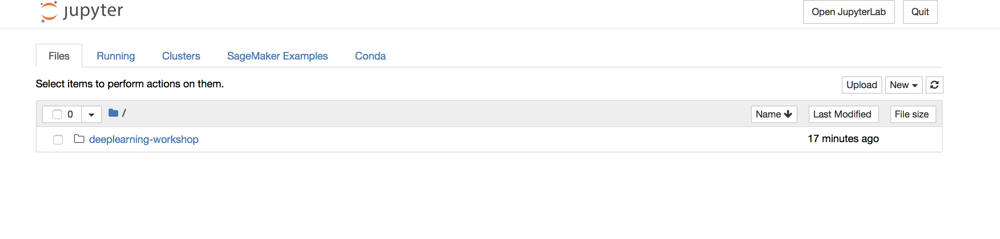
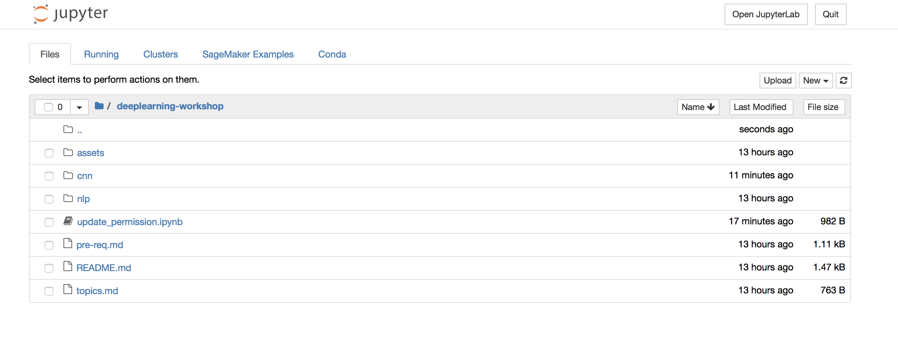
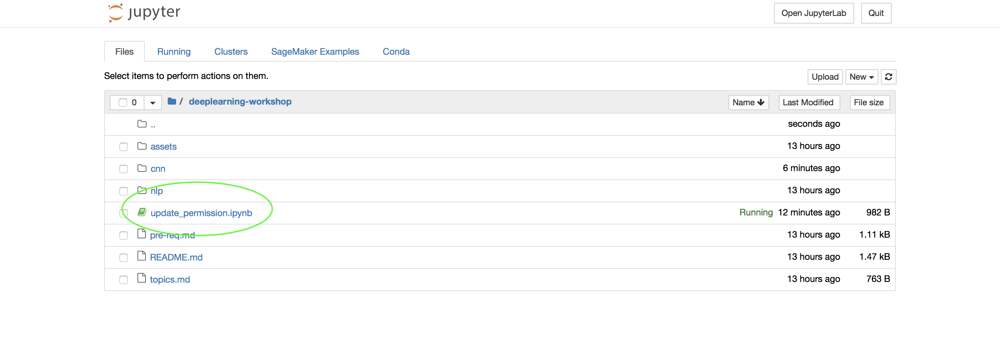
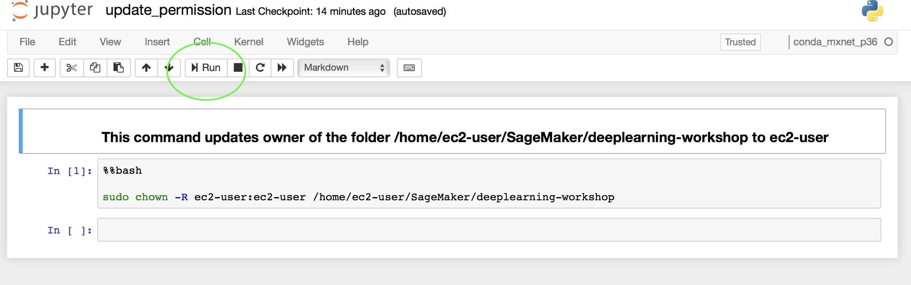

-----
# QWIKLab Instructions
----

Welcome to Apache MXNet Bootcamp. We will use Amazon SageMaker to run the Apache MXNet lab sessions.

1.	Go to [https://events-aws.qwiklabs.com/](https://events-aws.qwiklabs.com/) and create an account.

2.	Send the email-id, with which you registered in qwiklabs, to **wamy@amazon.com**  
 (Your QWIKLab account will be added to the student list in the lab. This will essential to get access to the lab.)
3.	Once you login to QwikLabs, click on the MXNet/Gluon BootCamp Lab
    

4. Once inside the lab, use the Notebook Instance and the credentials (Account ID, User Name, Password) provided to login to Amazon SageMaker jupyter notebook.
    

5. The lab materials from [nswamy's GitHub repo](https://github.com/nswamy/deeplearning-workshop) will already be available on the SageMaker Instance.
	
	

6. We need to update the permission on the the folder /home/ec2-user/SageMaker/deeplearning-workshop by running the update-permissions notebook from deeplearning-workshop folder.
	
	

7. Now we can access the material from the notebook instance and run through the exercises by going into the `deeplearning-workshop` directory.

8. Choose mxnet_p36 conda environment as the Kernel when executing a notebook.

###  
Lets get started. 

